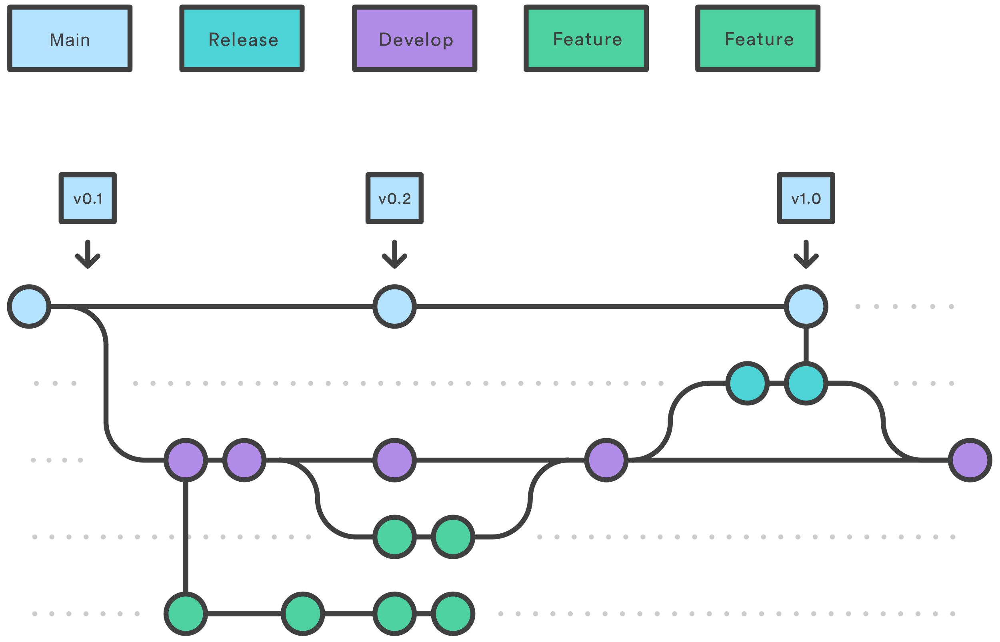
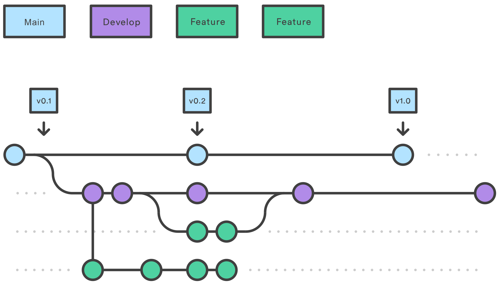
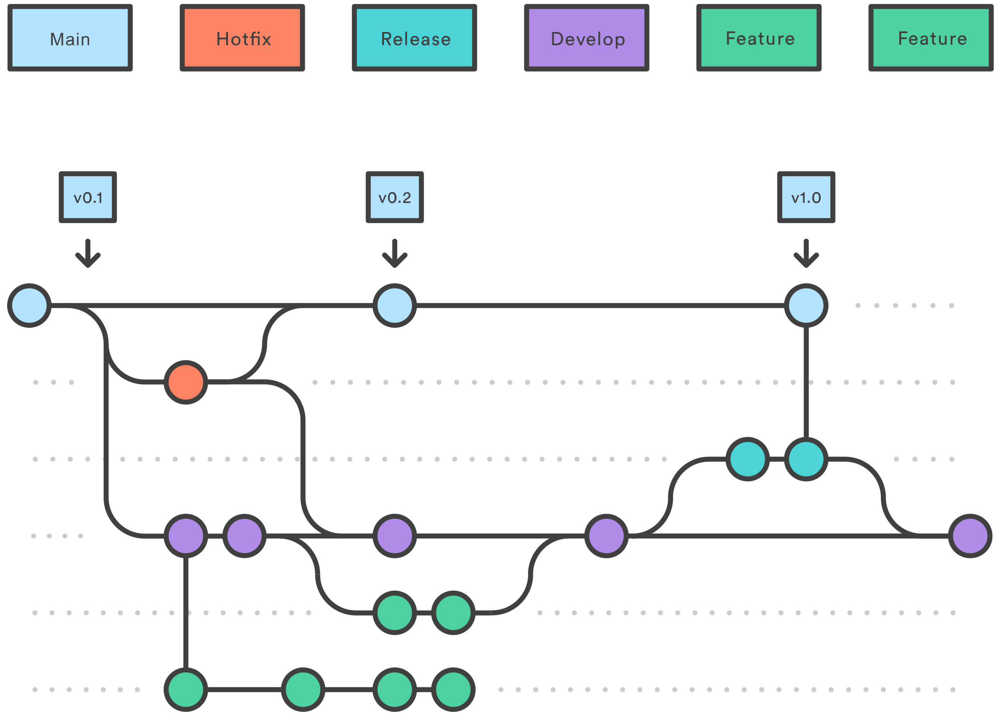

# [Git Flow](https://github.com/nvie/gitflow)

## O que é Gitflow?

O Gitflow é um modelo alternativo de ramificação do Git que consiste no uso de ramificações de `recurso`s e várias ramificações primárias. Ele foi publicado pela primeira vez e popularizado por Vincent Driessen no nvie. Comparado ao desenvolvimento baseado em troncos, o Gitflow tem mais ramificações de vida longa e commits maiores. Sob este modelo, os desenvolvedores criam uma ramificação de `recurso` e retardam o merge com a ramificação de tronco `principal` até que o `recurso` esteja completo. Essas ramificações de `recurso`s de longa duração exigem mais colaboração para fazer o merge e têm um risco maior de se desviarem da ramificação do tronco. Elas também podem introduzir atualizações conflitantes.

O Git flow na prática pode ser usado para projetos que têm um ciclo de `lançamento` agendado e para a prática recomendada de DevOps de entrega contínua. Este fluxo de trabalho não adiciona novos conceitos ou comandos além do necessário para o Fluxo de trabalho de ramificação de `recurso`. O que ele faz é atribuir funções bem específicas para diferentes ramificações e definir quando elas devem interagir. Além das ramificações de `recurso`, ele utiliza ramificações individuais para preparar, manter e registrar `lançamento`s. Com certeza, você também aproveita todos os benefícios do Fluxo de trabalho de ramificação de `recurso`: solicitações pull, experimentos isolados e colaboração mais eficiente.

## Como funciona



### Ramificações de desenvolvimento e `principal`

Ao invés de uma única ramificação `main`, esse fluxo de trabalho usa duas ramificações para registrar o histórico do projeto. A ramificação `main` armazena o histórico do `lançamento` oficial, e a ramificação `develop` serve como uma ramificação de integração para `recurso`s. Também é conveniente marcar todos os commits na ramificação `main` com um número de versão.

A primeira etapa serve para complementar a ramificação `main` padrão com uma ramificação `develop`. Um jeito simples de alcançar esse resultado é com um desenvolvedor criando uma ramificação `develop` no local e fazendo o push para o servidor:

```bash
git branch develop
git push -u origin develop
```

Esta ramificação vai conter o histórico completo do projeto, enquanto a ramificação `main` vai conter uma versão abreviada. Outros desenvolvedores agora vão precisar clonar o repositório central e criar uma ramificação de rastreamento para a de `develop`.

Ao utilizar a biblioteca de extensão do git-flow, executar git flow init no repositório existente vai criar uma ramificação de desenvolvimento:

```bash
$ git flow init


Initialized empty Git repository in ~/project/.git/
No branches exist yet. Base branches must be created now.
Branch name for production releases: main
Branch name for "next release development: develop


How to name your supporting branch prefixes?
Feature branches? [feature/]
release branches? release
hotfix branches? [hotfix/]
Support branches? [support/]
Version tag prefix? []


$ git branch
* develop
main
```

## Ramificações de `recurso`

### Passo 1. Crie o repositório

Cada novo `recurso` deve residir na própria ramificação, que pode ser enviada por push para o repositório central para backup/colaboração. No entanto, em vez de serem ramificações da ramificação `principal`, as ramificações feature usam a ramificação `develop` como pai. Quando um `recurso` é concluído, ele passa por merge de volta para a ramificação de desenvolvimento. Os `recurso`s não devem nunca interagir direto com a ramificação `main`.



Observe que as ramificações de `recurso`, combinadas com a ramificação de desenvolvimento, são, para todos os efeitos, o Fluxo de trabalho de ramificação de `recurso`s. No entanto, o Gitflow Workflow não para aí.

As ramificações de `recurso` são em geral criadas a partir da ramificação de desenvolvimento mais recente.

### Criação da ramificação de `recurso`

Sem as extensões do git-flow:

```bash
git checkout develop
git checkout -b feature_branch
```

Ao usar a extensão do git-flow:

```bash
git flow feature start feature_branch
```

Continue seu trabalho e use o Git como de costume.

### Finalização da ramificação de `recurso`

Quando você concluir o trabalho de desenvolvimento no `recurso`, a próxima etapa é mesclar a ramificação de `recurso` na de desenvolvimento.

Sem as extensões do git-flow:

```bash
git checkout develop
git merge feature_branch
```

Usando as extensões do git flow na prática:

```bash
git flow feature finish feature_branch
```

### Ramificações de `lançamento`


Uma vez que a ramificação `develop` adquiriu `recurso`s suficientes para um `lançamento` (ou uma data de `lançamento` predeterminada está se aproximando), você bifurca uma ramificação `release` a partir da ramificação `develop`. Criar esta ramificação dá início ao próximo ciclo de `lançamento`, portanto nenhum novo `recurso` pode ser adicionado depois deste ponto — apenas atualizações de segurança, geração de documentação e outras tarefas relacionadas ao `lançamento` devem ir nesta ramificação. Quando estiver pronta para ser lançada, a ramificação `release` passa por merge para a ramificação `main` e é marcada com o número da versão. Ela também deve passar por merge de volta para a ramificação `develop`, que pode ter progredido desde que o `lançamento` foi iniciado.

O uso da ramificação dedicada ao preparo de `lançamento`s possibilita que uma equipe aperfeiçoe o `lançamento` atual enquanto outra equipe continua a trabalhar nos `recurso`s para o próximo `lançamento`. Ele também cria fases de desenvolvimento bem definidas (por exemplo, é fácil dizer "Esta semana a gente está se preparando para a versão 4.0" e de fato ver como fica na estrutura do repositório).

A elaboração de ramificações de `lançamento` é outra operação de ramificação simples. Assim como as ramificações de `recurso`, as ramificações de `lançamento` são baseadas na ramificação de desenvolvimento. Uma nova ramificação de `lançamento` pode ser criada usando os seguintes métodos.

Sem as extensões do git-flow:

```bash
git checkout develop
git checkout -b release0.1.0
```

Ao utilizar extensões do git-flow:

```bash
$ git flow release start 0.1.0
Switched to a new branch release 0.1.0
```

Depois que a versão estiver pronta para o `lançamento`, vai ser feito o merge dela na ramificação `main` e na ramificação `develop` e, então, a ramificação `release` vai ser excluída. O processo de merge de volta para a ramificação `develop` é importante porque atualizações importantes podem ter sido adicionadas à ramificação `release` e elas devem ser acessíveis a novos `recurso`s. Se sua organização enfatiza a revisão de códigos, este seria o local ideal para uma solicitação pull.

Para finalizar a ramificação de `lançamento`, use os seguintes métodos:

Sem as extensões do git-flow:

```bash
git checkout main
git merge release 0.1.0
```

Ou, com a extensão do git-flow:

```bash
git flow release finish '0.1.0'
```

## Ramificações de `hotfix`



As ramificações de manutenção ou de “`hotfix`” são usadas para corrigir com rapidez `lançamento`s de produção. As ramificações de `hotfix` se parecem muito com ramificações `release` e feature, com a diferença de serem baseadas na ramificação `main` ao invés da ramificação `develop`. Esta é a única ramificação que deve ser bifurcada direto da ramificação `main`. Assim que a correção é concluída, deve ser feito o merge dela tanto na ramificação `main` quanto na ramificação `develop` (ou na ramificação `release` atual) e a ramificação `main` deve ser marcada com um número de versão atualizado.

Ter uma linha de desenvolvimento dedicada para atualizações de segurança permite que sua equipe aborde problemas sem ter que interromper o resto do fluxo de trabalho ou esperar o próximo ciclo de `lançamento`. Você pode pensar nas ramificações de manutenção como ramificações `release` ad hoc que trabalham em contato direto com a `main`. Uma ramificação de `hotfix` pode ser criada usando os seguintes métodos:

Sem as extensões do git-flow:

```bash
git checkout main
git checkout -b hotfix_branch
```

Ao utilizar extensões do git-flow:

```bash
$ git flow hotfix start hotfix_branch
```

Assim como acontece na finalização da ramificação `release`, é feito o merge da ramificação de `hotfix` tanto na ramificação `main` quanto na ramificação `develop`.

```bash
git checkout main
git merge hotfix_branch
git checkout develop
git merge hotfix_branch
git branch -D hotfix_branch
```

```bash
$ git flow hotfix finish hotfix_branch
```

## Exemplo

A seguir, um exemplo completo demonstrando um fluxo de ramificação de `recurso`. Supondo que exista uma configuração de repositório com uma ramificação `main`.

```bash
git checkout main
git checkout -b develop
git checkout -b feature_branch
# work happens on feature branch
git checkout develop
git merge feature_branch
git checkout main
git merge develop
git branch -d feature_branch
```

Além do fluxo de `recurso` e `lançamento`, um exemplo de `hotfix` é:

```bash
git checkout main
git checkout -b hotfix_branch
# work is done commits are added to the hotfix_branch
git checkout develop
git merge hotfix_branch
git checkout main
git merge hotfix_branch
```

## Resumo

Aqui é discutido o Gitflow Workflow. Gitflow é um dos muitos estilos de fluxos de trabalho Git que você e sua equipe podem utilizar.

Alguns dos principais aprendizados para saber sobre o Gitflow Workflow são:

-   O fluxo de trabalho é ótimo para um fluxo de trabalho de software baseado em `lançamento`.
-   O Gitflow oferece um canal dedicado de `hotfix`es para produção.

O Gitflow Workflow é:

1. Uma ramificação `develop` é criada a partir da `main`

2. Uma ramificação de `release` é criada a partir da ramificação de `develop`

3. As ramificações de `recurso` são criadas a partir da ramificação de desenvolvimento

4. Quando um `recurso` é concluído, ele é mesclado na ramificação de desenvolvimento

5. Quando a ramificação de `release` for concluída, ela vai ser mesclada na ramificação de `develop` e na `main`

6. Se for detectado um item na `main`, uma ramificação de `hotfix` vai ser criada a partir da `main`

7. Depois que a `hotfix` é concluída, ela é mesclada para as ramificações de desenvolvimento e `principal`
